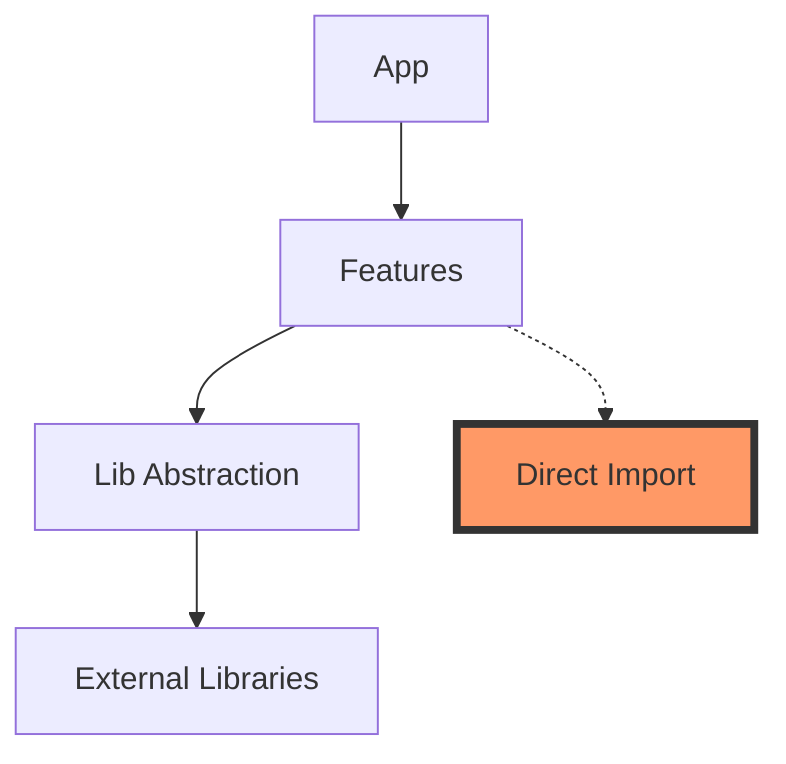

# 📚 ライブラリ統合ガイド - スパゲッティ化を防ぐために

## 🎯 このガイドの目的
新しいライブラリを追加する際に、プロジェクトがスパゲッティ化するのを防ぐための明確なルールとプロセスを定義します。

---

## ⚠️ スパゲッティ化の警告サイン

### 🚨 これらの兆候が見えたら要注意！
1. **同じ機能のライブラリが複数存在**
   - ❌ moment.js と date-fns と dayjs が共存
   - ❌ axios と fetch と node-fetch が混在

2. **責任範囲が不明確**
   - ❌ どのライブラリがどの機能を担当するか不明
   - ❌ 似た名前のユーティリティ関数が散在

3. **依存関係の爆発**
   - ❌ package.jsonが100行以上
   - ❌ node_modulesが1GB超え

---

## ✅ ライブラリ追加の黄金ルール

### 1. 追加前チェックリスト
```yaml
必須確認事項:
  - [ ] 既存のライブラリで実現できないか？
  - [ ] 本当に必要か？（YAGNI原則）
  - [ ] メンテナンスは活発か？（最終更新1年以内）
  - [ ] ライセンスは適切か？（MIT/Apache推奨）
  - [ ] バンドルサイズは妥当か？（<50KB推奨）
```

### 2. カテゴリ別管理
```typescript
// src/lib/dependencies.ts
export const DEPENDENCIES = {
  // 日付処理は1つだけ
  dateLibrary: 'date-fns',
  
  // HTTPクライアントは1つだけ
  httpClient: 'native-fetch',
  
  // 状態管理は1つだけ
  stateManagement: 'zustand',
  
  // UIライブラリは1つだけ
  uiLibrary: 'tailwind',
}
```

### 3. ライブラリ追加プロセス

#### Step 1: 提案書作成
```markdown
## ライブラリ追加提案

**ライブラリ名**: [名前]
**カテゴリ**: [UI/状態管理/ユーティリティ/etc]
**理由**: [なぜ必要か]
**代替案**: [検討した他の選択肢]
**影響範囲**: [どこで使用するか]
**バンドルサイズ**: [XXkb]
**週間ダウンロード数**: [XXX,XXX]
```

#### Step 2: レビューポイント
- 既存ライブラリとの重複はないか
- 将来的な移行コストは低いか
- チーム全員が理解できるか

#### Step 3: 実装ルール
```typescript
// ❌ 悪い例：直接インポート
import moment from 'moment'

// ✅ 良い例：抽象化レイヤー経由
import { formatDate } from '@/lib/date-utils'
```

---

## 🏗️ 推奨アーキテクチャ

### ディレクトリ構造
```
src/
├── lib/                    # ライブラリの抽象化レイヤー
│   ├── date-utils/        # 日付処理の統一インターフェース
│   ├── http-client/       # HTTPクライアントの統一インターフェース
│   └── dependencies.ts    # 依存関係の一元管理
├── features/              # 機能別モジュール
│   ├── auth/             # 認証機能
│   ├── user/             # ユーザー機能
│   └── product/          # 製品機能
└── shared/               # 共有コンポーネント・ユーティリティ
```

### 依存関係の可視化


---

## 📋 実践例

### 例1: 新しいチャートライブラリを追加したい場合

#### ❌ 悪い例
```typescript
// components/Dashboard.tsx
import { LineChart } from 'recharts'
import { BarChart } from 'chart.js'
import { PieChart } from 'd3'

// 3つの異なるチャートライブラリが混在！
```

#### ✅ 良い例
```typescript
// lib/charts/index.ts
export { LineChart, BarChart, PieChart } from './recharts-adapter'

// components/Dashboard.tsx
import { LineChart, BarChart, PieChart } from '@/lib/charts'
```

### 例2: 認証ライブラリの追加

#### ❌ 悪い例
```typescript
// pages/login.tsx
import { signIn } from 'next-auth/react'
import { Auth } from '@supabase/auth-ui-react'
import FirebaseAuth from 'firebase/auth'

// 複数の認証システムが混在！
```

#### ✅ 良い例
```typescript
// lib/auth/provider.ts
interface AuthProvider {
  signIn: (credentials: Credentials) => Promise<User>
  signOut: () => Promise<void>
  getSession: () => Promise<Session | null>
}

// lib/auth/supabase-provider.ts
export class SupabaseAuthProvider implements AuthProvider {
  // Supabase実装
}

// 使用側は抽象化されたインターフェースのみ参照
import { authProvider } from '@/lib/auth'
```

---

## 🔍 定期的な健全性チェック

### 月次レビュー項目
```bash
# 1. 未使用の依存関係をチェック
npx depcheck

# 2. 重複する機能のライブラリを探す
npm ls --depth=0 | grep -E "(date|time|moment|day)"

# 3. バンドルサイズを分析
npm run analyze

# 4. セキュリティ脆弱性をチェック
npm audit
```

### 健全性メトリクス
```yaml
健全:
  - dependencies: < 30個
  - devDependencies: < 20個
  - node_modules: < 500MB
  - 各カテゴリ1ライブラリ原則: 遵守

警告:
  - dependencies: 30-50個
  - node_modules: 500MB-1GB
  - 重複カテゴリ: 1-2個

危険:
  - dependencies: > 50個
  - node_modules: > 1GB
  - 重複カテゴリ: 3個以上
```

---

## 💡 ベストプラクティス

### 1. Facade パターンの活用
```typescript
// lib/storage/facade.ts
export interface StorageAdapter {
  get(key: string): Promise<any>
  set(key: string, value: any): Promise<void>
  remove(key: string): Promise<void>
}

// 実装を切り替え可能に
export const storage: StorageAdapter = 
  process.env.STORAGE_TYPE === 'redis' 
    ? new RedisAdapter()
    : new LocalStorageAdapter()
```

### 2. ライブラリ固有の型を漏らさない
```typescript
// ❌ 悪い例
import { AxiosResponse } from 'axios'
export function getUser(): Promise<AxiosResponse> { }

// ✅ 良い例
export function getUser(): Promise<User> { }
```

### 3. 移行を考慮した設計
```typescript
// 将来的にライブラリを変更しても影響を最小限に
export const DateUtils = {
  format: (date: Date, pattern: string) => {
    // 現在はdate-fnsを使用
    return format(date, pattern)
    // 将来的にdayjsに変更しても、この関数のインターフェースは変わらない
  }
}
```

---

## 🚀 実装ガイドライン

### 新規ライブラリ追加時のコード例
```typescript
// 1. 提案書を作成
// docs/proposals/add-animation-library.md

// 2. 抽象化レイヤーを作成
// lib/animation/index.ts
export interface AnimationEngine {
  animate(element: HTMLElement, options: AnimationOptions): Promise<void>
  cancel(animationId: string): void
}

// 3. 実装を作成
// lib/animation/framer-motion.ts
import { motion } from 'framer-motion'

export class FramerMotionEngine implements AnimationEngine {
  // 実装
}

// 4. 使用例
// components/AnimatedButton.tsx
import { animationEngine } from '@/lib/animation'

export function AnimatedButton() {
  const handleClick = () => {
    animationEngine.animate(ref.current, { scale: 1.2 })
  }
}
```

---

## 📝 チェックリストテンプレート

```markdown
## ライブラリ追加チェックリスト

### 追加前
- [ ] 既存ライブラリで代替不可能
- [ ] package.jsonの依存関係数が適切（<30）
- [ ] カテゴリ内での重複なし
- [ ] チーム内で合意形成済み

### 実装時
- [ ] 抽象化レイヤー作成
- [ ] 型定義の適切な隠蔽
- [ ] ドキュメント更新
- [ ] サンプルコード作成

### 追加後
- [ ] バンドルサイズの確認
- [ ] パフォーマンステスト
- [ ] セキュリティ監査
- [ ] README更新
```

---

## 🎯 まとめ

**スパゲッティ化を防ぐ3つの原則**
1. **1カテゴリ1ライブラリ**
2. **抽象化による疎結合**
3. **定期的な健全性チェック**

これらを守れば、ライブラリを追加してもクリーンなアーキテクチャを維持できます！