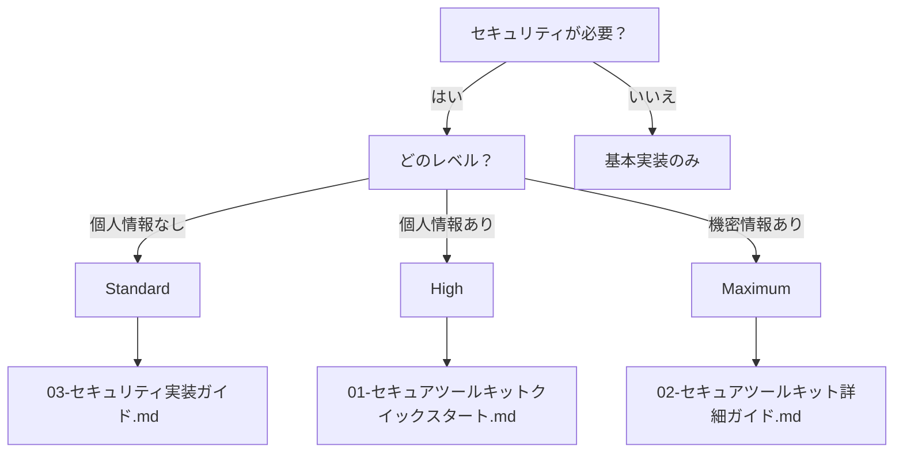

# 🔐 セキュリティガイド

アプリケーションのセキュリティを確保するための包括的なガイドです。

## 📚 ドキュメント一覧

### 🆕 Secure Toolkit（推奨）
- **[セキュアツールキットクイックスタート](./01-セキュアツールキットクイックスタート.md)** 🌟
  - 5分でセキュリティ実装
  - 初心者向けの簡単ガイド
  - 医療機関レベルのセキュリティを実現

- **[セキュアツールキット詳細ガイド](./02-セキュアツールキット詳細ガイド.md)**
  - 全機能の詳細解説
  - 実装例とベストプラクティス
  - トラブルシューティング

### 基本的なセキュリティ
- **[セキュリティ実装ガイド](./03-セキュリティ実装ガイド.md)**
  - 基本的なセキュリティ対策
  - 段階的な実装ガイド
  - チェックリスト付き

- **[XSS対策ガイド](./04-XSS対策ガイド.md)**
  - クロスサイトスクリプティング対策
  - 具体的な実装例
  - テスト方法

## 🎯 セキュリティレベル

### 🟢 Standard（標準）
- 個人プロジェクト、ブログ向け
- 基本的な認証とデータ保護
- [基本実装ガイド](./03-セキュリティ実装ガイド.md)を参照

### 🟡 High（高度）
- ECサイト、会員制サービス向け
- 2段階認証、暗号化対応
- [Secure Toolkit Standard](./01-セキュアツールキットクイックスタート.md)を推奨

### 🔴 Maximum（最高）
- 医療・金融システム向け
- 完全な暗号化、監査ログ
- [Secure Toolkit Maximum](./02-セキュアツールキット詳細ガイド.md#maximumレベル)を使用

## 💡 どこから始める？

## 🚀 クイックスタート

1. **簡単に始めたい**
   → [セキュアツールキットクイックスタート](./01-セキュアツールキットクイックスタート.md)

2. **基本から学びたい**
   → [セキュリティ実装ガイド](./03-セキュリティ実装ガイド.md)

3. **全機能を知りたい**
   → [セキュアツールキット詳細ガイド](./02-セキュアツールキット詳細ガイド.md)

## ⚠️ 重要な注意事項

- セキュリティは後から追加するより、最初から実装する方が簡単
- Secure Toolkitを使えば、複雑な実装も自動化できる
- 不明な点は、過小評価せず高めのレベルを選択

## 🔗 関連ドキュメント

- 開発の基本 → [開発ガイド](../02-開発ガイド/)
- 本番環境 → [デプロイガイド](../04-デプロイ・本番環境/)
- トラブル対応 → [トラブルシューティング](../05-トラブルシューティング/)