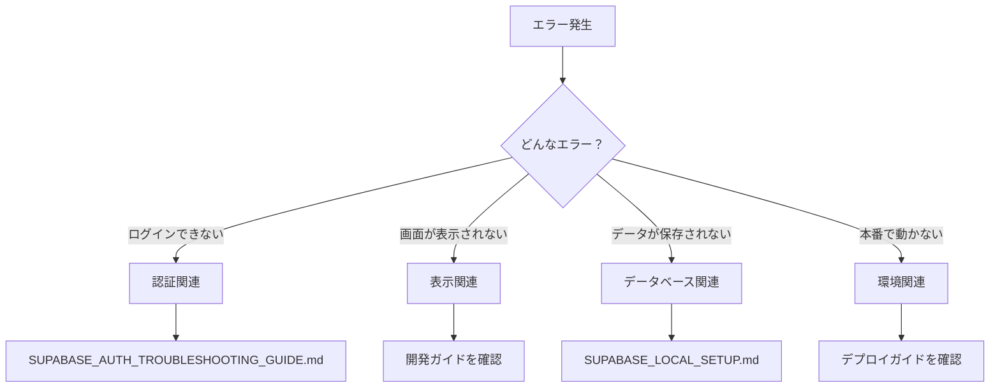

# 🔧 トラブルシューティング

開発・運用中に発生する問題の解決方法をまとめています。

## 📚 ドキュメント一覧

### Supabase関連
- **[SUPABASE_AUTH_TROUBLESHOOTING_GUIDE.md](./SUPABASE_AUTH_TROUBLESHOOTING_GUIDE.md)**
  - 認証エラーの解決方法
  - よくある認証の問題
  - デバッグ方法

- **[SUPABASE_LOCAL_SETUP.md](./SUPABASE_LOCAL_SETUP.md)**
  - ローカル環境の設定
  - 開発環境での動作確認
  - 設定ファイルの例

- **[supabase_config_example.md](./supabase_config_example.md)**
  - 設定ファイルのサンプル
  - 各パラメータの説明

### デバッグ
- **[STAGING_LOGIN_DEBUG_GUIDE.md](./STAGING_LOGIN_DEBUG_GUIDE.md)**
  - ステージング環境のログイン問題
  - デバッグ手順
  - 解決策

## 🎯 問題解決フロー



## 💡 よくある問題と解決策

### 🔐 認証・ログイン
- **「ログインできない」**
  - メールアドレス/パスワードを確認
  - Supabaseの設定を確認
  - [認証トラブルシューティング](./SUPABASE_AUTH_TROUBLESHOOTING_GUIDE.md)参照

- **「セッションが切れる」**
  - セッションタイムアウト設定を確認
  - リフレッシュトークンの実装

### 🖥️ 表示・UI
- **「画面が真っ白」**
  - ブラウザのコンソールでエラー確認
  - ビルドエラーがないか確認
  - 環境変数の設定確認

- **「スタイルが崩れる」**
  - CSSの読み込み順序
  - Tailwind CSSの設定
  - ブラウザキャッシュをクリア

### 💾 データベース
- **「データが保存されない」**
  - Supabaseの接続設定
  - RLS（Row Level Security）の設定
  - [ローカル設定ガイド](./SUPABASE_LOCAL_SETUP.md)確認

### 🌐 環境・デプロイ
- **「本番環境で動かない」**
  - 環境変数の設定
  - ビルド設定の確認
  - [デプロイガイド](../04-deployment/)参照

## 🆘 解決できない場合

1. **エラーメッセージを記録**
   - 完全なエラーメッセージ
   - 発生した操作
   - 環境情報（開発/本番）

2. **AIに相談**
   ```
   以下のエラーが発生しました：
   [エラーメッセージ]
   
   実行した操作：[操作内容]
   環境：[開発/本番]
   
   解決方法を教えてください。
   ```

3. **段階的に確認**
   - 最小限の構成で動作確認
   - 一つずつ機能を追加
   - 問題の切り分け

## 🔗 関連ドキュメント

- 初期設定 → [はじめての方へ](../01-getting-started/)
- 開発ガイド → [開発](../02-development/)
- セキュリティ → [セキュリティガイド](../03-security/)
- 本番環境 → [デプロイガイド](../04-deployment/)